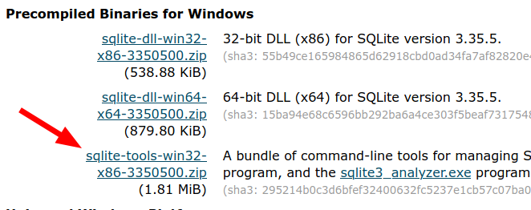
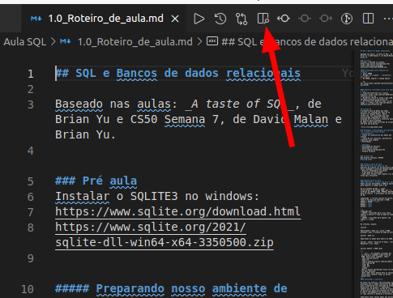
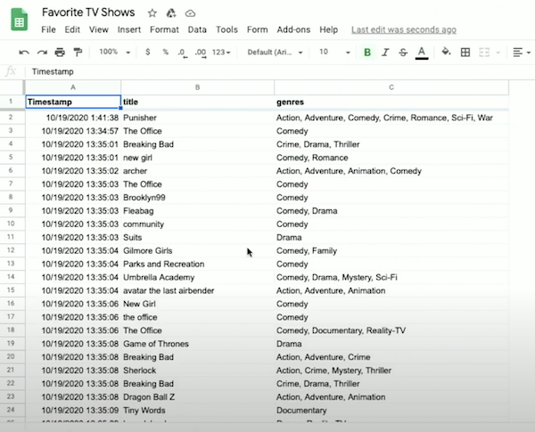
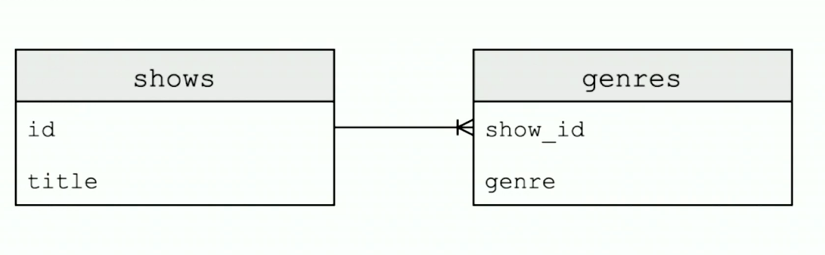
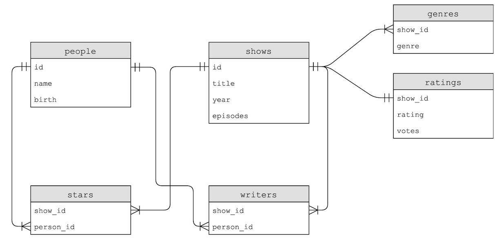
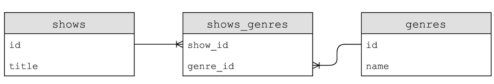

## Introdução
Este é o roteiro utilizado para ministrar a aula introdutório de SQL para a turma de Desenvolvimento Web da Adestec (Dev101), turma de 2021.
O roteiro, bancos de dados e exercícios foram compilados a partir da aula da semana 7 do curso CS50, de Harvard. Originalmente disponível [aqui](https://cs50.harvard.edu/x/2021) ou em português [aqui](https://cc50.estudarfora.org.br/). Além do vídeo _A taste of SQL_, de Brian Yu, disponível [nesse link.](https://www.youtube.com/watch?v=S_-gaQpyi5s&t=2480s)

A licença de uso desse material está disponível, originalmente, [aqui.](https://cs50.harvard.edu/x/2021/license/)
## IDE e ambiente de trabalho
A plataforma do curso CS50 disponibiliza uma IDE online com capacidade de executar códigos em C, Python, Javascript, SQL, entre outras linguagens. No entanto, a prática a seguir pode ser desenvolvida na máquina local, bastando instalar o sqlite na máquina.

### Instalar o SQLITE3 no windows:
Acesse a página de download:
https://www.sqlite.org/download.html

No momento da criação desse material, o sqlite podia ser baixado diretamente neste link:
https://www.sqlite.org/2021/sqlite-dll-win64-x64-3350500.zip

No entanto, como referência futura, baixe a versão completa que contém o executário sqlite3.exe, conforme imagem abaixo:



Há duas maneiras de instalar o sqlite no windows, a primeira e recomendada:
Descompacte o arquivo para a pasta c:/sqlite e adicione o caminho do executável ao PATH do windows.
A segunda maneira, e mais _porca_, é copiando o executário sqlite3.exe para a mesma pasta onde está contido o banco de dados do exercício. Essa segunda maneira é prática quando há que se configurar _n_ máquinas para ministrar um curso e há pouco tempo disponível.

### Instalação no linux (ubuntu)
sudo apt install sqlite3

_linux sendo linux_, obrigado!

## Preparando nosso ambiente de trabalho.
1. Abrir CMDER, terminal, bash, cmd ou que estiver utilizando.
1. Navegar até a pasta `../Documentos/Seu_usuario`
1. No CMDER, digitar o código abaixo:
```sh
git clone https://github.com/wfoschiera/sql_dev101
```
1. Abrir roteiro da aula (pressupondo que o VS code já está instalado)
   Aqui, qualquer visualizador de markdown pode ser utilizado no lugar do VS code (Atom, Sublime, etc.)
```sh
cd /sql_dev101
code 1.0_Roteiro_de_aula.md
```
1. habilitar visualização de markdown no VS Code



## Arquivos utilizados nessa aula (parte 1 e 2):

1. Planilha Favorites.csv e outros arquivos: https://cdn.cs50.net/2020/fall/lectures/7/src7.zip
1. DB Movies (Parte 3) https://cdn.cs50.net/2021/x/seminars/sql/movies.db
1. DB Fiftyville (Desafio final, se der tempo ;) ) https://cdn.cs50.net/2021/x/seminars/sql/fiftyville.db


## Parte 1 - Descrição do exerício
A primeira base de dados que vamos utilizar foi coletada por meio de um formulário (Google Forms). Neste formulário, foi solicitado que cada entrevistado respondesse o nome do programa de TV favorito e inserisse quais os gêneros desse programa.
Os dados foram então extraídos em formato CSV para uma planilha. Ficando dessa forma:



### Vantagens e desvantagens de planilhas, csv e afins (flat data format) comparados a bancos de dados

1. Planilhas
   
> __Desvantagens__
> - Limite na visualização dos dados das colunas
> - Limitação nas consultas, possibilita consultas mais simples
> - Dificuldade de refinar resultados eliminando colunas na visualização
> - Performance pode ser um problema até mesmo em pequenas bases de dados
> 
> __Vantagens__
> - Facilidade de manuseio
> - Apresentação visual
> - Fácil importação/manipulação
> - Permite formulas
> - mais fáceis de criar e popular dados

## Começando o 'mão na massa'!
### Manipulação dos dados em CSV
Abertura do arquivo csv em aplicativo de texto (notepad) e planilha (Google Sheets)
- Qual(is) problema(s) existe(m)?
- O que pode ser melhorado?
- Como fazer buscas? Como organizá-los de forma mais eficiente?

### Segunda parte da aula
#### Importanto o arquivo CSV para o Sqlite
Vamos iniciar executando o SGBD do sqlite para importar os dados para o DB.

Em se tratando de DBs, é comum encontrarmos a expressão CRUD, que é o acrônimo de CREATE, READ, UPDATE, DELETE, para se referir às principais funções de um DB.

Comparando às funções nativas do sqlite, temos 5 funções que executam o CRUD:

 **C** - CREATE e INSERT

 **R** - SELECT 

 **U** - UPDATE 

 **D** - DELETE 

---
Lembrando que:
> CREATE é utilizado para criar novas tabelas e definir o tipo de dado de cada coluna.

> INSERT é utilizado para popular uma tabela existente
---

Agora, vamos iniciar as atividades utilizando a linguagem SQL, para tanto, no terminal (linux), digite:
```
sqlite3
```
Se estiver utilizando Windows, localize o aplicativo sqlite3.exe e execute-o para abrir um prompt de comando do SQL.

Feito isso, vamos habilitar o BD para importar dados no formato csv, assim o SGBD entenderá qual o formato do dado de entrada.
```
sqlite> .mode csv
```
Importando os dados para dentro do SGBD.
```
sqlite> .import 'Favorite TV Shows - Form Responses 1.csv' shows
```
Se tudo correu bem até aqui, conseguiremos iniciar nossas consultas e conhecer a estrutura das tabelas. Primeiro, vamos visualizar todos os dados da tabela `shows`.

```
sqlite> SELECT * FROM shows
```
---
 > __NOTA:__ Os comandos iniciados por `.` (como é o caso do .mode) se referem a comandos específicos do SGBD. Entre esses comandos, temos:
 
 .open nome_do_arquivo
 
 .mode csv
 
 .import nome_do_arquivo nome_da_tabela
 
 .save nome_do_DB
 
 .timer ON
 
 .timer OFF
 
 .schema
 >Mais a diante abordaremos essas funções com mais detalhes.
 >Quer saber mais? Digite help no prompt do sqlite para conhecer todas as opções disponíveis.
---

#### Analisando a estrutura do DB

No exercício anterior, não precisamos nos preocupar com o schema (estrutura) do DB, pois a importação foi realizada de forma automática. No entanto, é importante lembrar que um DB tem a função de otimizar as buscas e como o carregamento foi automático, não há como intervir e melhorar a estrutura.

Importante notar nestes dados que muitos __programas de tv__ possuem seus *nomes* repetidos, assim como seus _gêneros_. Já vamos corrigir isso, mas antes...

Alguém consegue me dizer ONDE esse DB está salvo? Ou melhor, qual o caminho no S.O. da localização dele?

Na verdade, ele não está salvo em disco, apenas carregado na memória. Para previnir imprevistos, vamos salvá-lo com persistência em disco.
```
sqlite> .save shows_dev101
```

Voltando à duplicação dos dados...
Uma forma de prevenir isso, é criando-se primeiro a estrutura do DB depois popula-se com os dados.

Inclusive, há uma palavra reservada no SQL para especificar a criação de uma coluna com dados únicos, é a palavra `UNIQUE`.

Abaixo, segue um exemplo de como popular um banco de dados utilizando uma linguagem de programação e SQL.
O programa abaixo só funcionará na IDE do curso CS50, disponível [aqui](https://ide.cs50.io/)

```python {.line-numbers}
import csv

from cs50 import SQL

open("shows.db", "w").close()
db = SQL("sqlite:///shows.db")

db.execute("CREATE TABLE shows (id INTEGER, title TEXT, PRIMARY KEY(id))")
db.execute("CREATE TABLE genres (show_id INTEGER, genre TEXT, FOREIGN KEY(show_id) REFERENCES shows(id))")

with open("Favorite TV Shows - Form Responses 1.csv", "r") as file:
    reader = csv.DictReader(file)
    for row in reader:
        title = row["title"].strip().upper()

        id = db.execute("INSERT INTO shows (title) VALUES(?)", title)

        for genre in row["genres"].split(", "):
            db.execute("INSERT INTO genres (show_id, genre) VALUES(?, ?)", id, genre)
```
---
> Algumas observações aqui:
>- Estamos criando novas tabelas e logo após populando com os >dados do CSV
>- PRIMARY KEY (Chave primária)
>- FOREIGN KEY (Chave estrangeira)
>
>Poderiamos ter utilizados outras regras para a criação, por >exemplo:
>
>- UNIQUE (Único, esse campo não pode contar valores repetidos)
>- NOT NULL (Não Nulo)
>
>No entanto, para este exemplo simples, não vem ao caso.
---


O diagrama das tabelas criadas ficará assim:



Para finalizar o uso desse DB, vamos mostrar os dados das tabelas shows e genres.

```
SELECT * FROM shows;

SELECT * FROM shows WHERE title = 'The Office';

SELECT * FROM shows WHERE title = 'THE OFFICE';

SELECT DISTINCT(title) FROM shows;

SELECT * FROM genres WHERE show_id = 4;

SELECT * FROM genres WHERE show_id = (SELECT id FROM shows WHERE title = 'THE OFFICE');
```

### Terceira parte da aula
#### Aprofundando nossas buscas e colocando a mão na massa!
<!-- - Para carregar o DB para o CS50:

```sh
~/ $ wget https://cdn.cs50.net/2021/x/seminars/sql/movies.db
```
 -->

#### Carregando DB shows no sqlite3

```sh
~/ $ sqlite3 src_CS50_Week_7/imdb/shows.db
```

### Executar comandos Sqlite na IDE


Retornar schema (estrutura) do DB

```sh
sqlite> .schema
```

Ou, para facilitar a visualização, veremos o diagrama de shows.db:



Agora, vamos ver como realizar consultas simples no banco. A primeira, como retornar _todos_ os dados de uma tabela:
```sh
sqlite> SELECT * FROM shows;
```

Lembrando: 
* `SELECT`: é a função que SELECIONA dados da tabela de acordo com as restrições subsequentes;
* `*`: Significa retorne todas as colunas existentes
* `FROM`: Precede o nome da tabela no DB
* `shows`: Nome da tabela do db que desejamos obter os dados

---
> **_NOTA_**: Apesar das palavras reservadas em SQL não serem case sensitive, é uma boa prática digitá-las em maiúsculas. Além disso, alguns interpretadores precisam ser informados do final do comando, para isso usa-se `;`.
---

### Como refinar os resultados:
```sh
sqlite> SELECT * FROM shows WHERE title = 'The Office';
```

No comando anterior, solicitamos `*` (todas) as colunas da tabela _shows_ `WHERE` (onde) o valor do campo _title_ (título) era igual a _'The Office'_.

Ainda é possível refinar a pesquisa, informando quais colunas retornarão na consulta, ao invés de solicitar todas (`*`).
```sh
sqlite> SELECT title, year FROM shows WHERE title = 'The Office';
```
O retorno dessa consulta será:
```
title | year
The Office | 1995
The Office | 2001
The Office | 2005
The Office | 2010
The Office | 2012
The Office | 2019
```

Posso refinar usando condicionais dentro do `WHERE`, dessa forma:

```sh
sqlite> SELECT title, year FROM shows WHERE year > 2020;
```
Ou, se quiser saber _quantos_ programas foram lançados após 2020:
```
sqlite> SELECT COUNT(*) FROM shows WHERE year > 2020;
```
Que retornará

```
COUNT(*)
615
```

Posso também consultar por resultados que correspondam parcialmente ao título do filme, dessa forma:
```
sqlite> SELECT * FROM shows WHERE title LIKE '%Titanic%';
```
---
> **_NOTA:_** Realizando a consulta utilizando `LIKE` em conjunto ao `WHERE`, aceita-se a _wildcard_ `%` que significa que pode conter caracteres antes ou depois da palavra pesquisada.
---

### Associando consultas:
Digamos que você precise saber quais gêneros de um determinado filme. As informações disponíveis são: 
1) há uma tabela `genres` onde há uma coluna chamada `show_id`; 
1) há uma tabela `shows` que contém as colunas `id` e `title` de um filme em particular. 

Então, é possível realizar a consulta em duas etapas, dessa forma:

```
sqlite> SELECT * FROM shows WHERE title = 'Stranger Things' and year = 2016;
```
Que me retorna:
```
id | title | year | episodes
4574334 | Stranger Things | 2016 | 34
```
---
> **_NOTA:_** Existem dois _shows_ chamados Stranger Things e sei que o que desejo a `id` é o de 2016.
---

Conhecendo o `id`, agora posso consultar os gêneros:
```
sqlite> SELECT * FROM genres WHERE show_id = 4574334;
```
No entanto, dessa forma, preciso realizar duas consultas ao `DB`, sendo que posso obter a resposta em uma única requisição, fazendo, de forma grosseira, dessa maneira:

```
sqlite> SELECT * FROM genres WHERE show_id = (
  SELECT id FROM shows WHERE title = 'Stranger Things' and year = 2016);
```

### Refinando a apresentação dos resultados

Antes de iniciarmos, vamos utilizar uma nova ferramenta do DB, o tempo gasto na execução do comando. Para isso, digite o comando abaixo:
```
sqlite> .timer ON
```

#### Ordenação:

* ORDER BY

```
sqlite> SELECT * FROM shows WHERE title = 'The Office' ORDER BY episodes DESC;
```
---
> **_NOTA:_** `DESC` no final significa _Descending order_ (decrescente).
---
#### Limitando a quantidade de resultados esperados:

```
sqlite> SELECT * FROM shows WHERE title = 'The Office' ORDER BY episodes DESC LIMIT 1;
```
---
> **_NOTA:_** `LIMIT` irá limitar a quantidade de resultados esperados.
---

### Associando pesquisas de uma forma mais precisa
Digamos que preciso retornar o nome dos atores da série _The Office_. Para tanto, preciso saber o `show_id` desta série e buscar por esse `show_id` na tabela `stars`, que me retornará o `stars_id` dos atores. No entanto, saber o `stars_id` dos atores não é tão útil quanto saber seus nomes.

Assim, podemos fazer as primeiras consultas dessa forma:

```
sqlite> SELECT id FROM shows WHERE title = 'The Office' ORDER BY episodes DESC LIMIT 1;
```
Que retorna o `id` da série The Office

```
id
386676
```
Depois, usando esse id, posso buscar os atores da série:
```
sqlite> SELECT * FROM stars WHERE show_id = 386676;
```
Que irá retornar o `id` de todos os atores, dessa forma:
```
show_id | person_id
386676 | 1526554
386676 | 136797
386676 | 278979
386676 | 1024677
386676 | 933988
386676 | 1534715
386676 | 1580911
```
Então, associando essas buscas, consigo obter os nomes dos atores, realizando a query abaixo:
```
sqlite> SELECT name FROM people WHERE id = 1526554;
```
Se a busca for realizada da forma anterior, estaremos desprezando a principal característica dos DB relacionais. Para corrigir isso, vamos _aninhar_ a pesquisa:
```
sqlite> SELECT name FROM people WHERE id = (SELECT person_id FROM stars WHERE show_id = (SELECT id FROM shows WHERE title = 'The Office' ORDER BY episodes DESC LIMIT 1));
```
---
> **_NOTA:_** Aninhei as consultas que retornam (da última para a primeira): 
1) o `id` do programa de tv de acordo com o `title` informado;
1) o `person_id` onde o `show_id` corresponde ao valor especificado; 
1) o `name` do ator baseado no `id`. 
---
O resultado dessa consulta é:
```
name
Angela Kinsey
```
Opa, mas não era isso o esperado. 

Acontece que ao utilizar o sinal de `=` para localicar os `person_id` na consulta, o SQL retorna o primeiro valor encontrado e ignora os demais, para corrigir isso, utilizamos `IN`, conforme abaixo:
```
sqlite> SELECT name FROM people WHERE id IN (SELECT person_id FROM stars WHERE show_id = (SELECT id FROM shows WHERE title = 'The Office' ORDER BY episodes DESC LIMIT 1));
```
Agora o resultado corresponde ao que esperávamos:
```
name
Steve Carell
Jenna Fischer
Rainn Wilson
John Krasinski
Angela Kinsey
Leslie David Baker
Brian Baumgartner
```

### Pausa - Atividade 1

Revisando o que vimos até aqui:
- Como criar um DB
- Como carregar os dados para um DB
- Como recuperar os dados usando SELECT
- Como associar dados com buscas simples
- Como associar dados com buscas concatenadas

Ainda temos MUITAS outras funções que podemos utilizar, eis alguns exemplos:

- AVG
- COUNT
- DISTINCT
- LOWER
- MAX
- MIN
- UPPER
- ...

> EXEMPLO:
```
SELECT DISTINCT(title) FROM shows;
```

### Clauses (Regras)
- WHERE  
- HAVING
- ORDER BY
- GROUP BY
- LIMIT
- ...

> EXEMPLO:
```
SELECT DISTINCT(title) FROM shows;
SELECT title, COUNT(genre) FROM genres 
JOIN shows ON shows.id = genres.show_id
GROUP BY title ORDER BY title DESC LIMIT 100;
```
### Operações com as tabelas (INSERT, UPDATE, DELETE)
> EXEMPLO:
```
INSERT INTO shows (title, year, episodes) VALUES ("The noite", 2010, 40);
SELECT * FROM shows WHERE title = "The noite";
```
```
UPDATE shows SET episodes = 100 WHERE title = "The noite";
SELECT * FROM shows WHERE title = "The noite";
```
```
DELETE FROM shows WHERE title = "The noite";
SELECT * FROM shows WHERE title = "The noite";
```

---
>__Nota:__ __NUNCA__ se esqueça de utilizar uma clásula (p.e. WHERE) quando for realizar uma operação de exclusão (DELETE). Uma dica valiosa é realizar um SELECT primeiro e verificar se o resultado retornado é exatamento o que se deseja excluir.
---
### Otimizações
#### Normalização do banco de dados:

Quando há uma relação de muitos para muitos, é necessário criar uma Join Table. Essa tabela conterá apenas chaves estrangeiras e fará o link entre duas tabelas que possuem valores repetidos uma na outra. Por exemplo:
A tabela _shows_ e a tabela _genres_ possuem valores uma na outra. Um _show_ pode conter vários _gêneros_, assim como um _gênero_ pode estar relacionado a vários _shows_. Uma _join table_ que representa essa normalização ficará conforme o diagrama abaixo:



**Exemplo utilizando Google Sheets!**


#### Otimização de consultas utilizando índices
Índices possuem a estrutura do tipo árvore (Tree). De maneira simples, conseguem realizar consultas com O(log N).


Recapitulando, a busca _comum_ possui tempo de processamento O(n), ou seja, é preciso passar por **todos** os valores para realizar a busca. Quando criamos um índice passamos a utilizar a estrutura de árvore para realizar a busca, o que reduz drasticamente o tempo de consulta. Vejamos o exemplo a seguir:

1. Busca sem índice:
```
sqlite> SELECT * FROM shows WHERE title = "The office";
Run Time: real 0.012 user 0.011130 sys 0.000000
```
1. Criando índice para tabela shows
```
sqlite> CREATE INDEX title_index ON shows (title);
```
1. Realizando novamente a busca, agora usando índice de forma implícita
```
sqlite> SELECT * FROM shows WHERE title = "The office";
Run Time: real 0.000 user 0.000063 sys 0.000037
```

#### Otimização de queries utilizando JOIN
Digamos que agora eu gostaria de obter como resultado o nome dos shows onde há o ator Steve Carell. Se olharmos no diagrama, vamos ver que precisamos fazer 3 consultas.
1. Qual o id do ator
1. Qual o show_id da tabela stars, onde há o id do ator
1. Qual o titulo dos shows de acordo com seus ids

Em SQL, faremos a query abaixo:
```
sqlite> SELECT title FROM shows WHERE id IN
(SELECT show_id FROM stars WHERE person_id =
(SELECT id FROM people WHERE name = "Steve Carell"));
```
No entanto, a forma mais adequada de realizar essa consulta, é utilizando JOIN, conforme apresentado abaixo:

```
sqlite> SELECT title FROM people
JOIN stars ON people.id = stars.person_id
JOIN shows ON stars.show_id = shows.id
WHERE name = "Steve Carell";
```
```
Run Time: real 1.354 user 0.682453 sys 0.628986
```
---
> __Nota:__ De tudo que vimos até agora, essa query é o mais _estranho_ ou _complexo_ até o momento. Com o tempo e a prática, essas consultas se tornarão mais claras. Não se preocupe!
---
Vamos olhar o diagrama e analisar o que essa consulta faz:


Agora, se observarmos os tempos, veremos que a última consulta foi mais lenta que as demais. Isso por que precisamos criar índices para as demais tabelas. Assim, faremos:

```
CREATE INDEX person_index ON stars (person_id);
CREATE INDEX show_index ON stars (show_id);
CREATE INDEX name_index ON people (name);
```
```
Run Time: real 0.014 user 0.000409 sys 0.000000
```

Continuação...

1. SQL Injection
> importância de utilizar a sintaxe SQL dentro de outra >linguagem), exemplo: 
>
>```
>INSERT INTO genres (show_id, genre) VALUES(?, ?)
>```
>
2. Race conditions

#### Bancos de dados utilizados nessa aula:
https://cdn.cs50.net/2021/x/seminars/sql/movies.db
https://cdn.cs50.net/2021/x/seminars/sql/fiftyville.db


## TODO
- Incluir explicação sobre a criação de tabelas (CREATE TABLE...)
- Melhorar a explicação onde há a manipulação dos dados usando python, para ficar mais legível e mais didática.
- Acrescentar mais informação sobre JOIN
- Acrescentar informação sobre chaves (primárias e estrangeiras)
- Não acrescentar tópicos sobre queries avançadas, views, procedures pois não fazem parte do objetivo dessa aula.